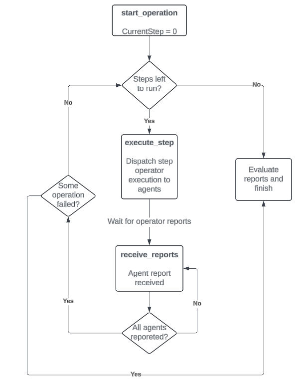

# 18. Agent operations orchestration

Date: 2025-01-28

## Status

Accepted

## Context

Follow up of ADR [17. Agent Operations Framework](https://github.com/trento-project/docs/blob/main/adr/0017-agent-operations-framework.md) which describes the actions to implement
write operations in the Trento agents. In this case, this ADR describes the orchestration layer, which takes care of dispatching all the operation commands to the agents.

The framework must be able to orchestrate multi-agent and multistep operations, as many operations are complex, including multiple clustered targets and actions that must be sequential in time.
It must be able of sending the operator actions to the agents and wait for the report. Once the report is received, decide to move on with the next operation steps or stop the operation as failed.

## Decisions

The operations framework orchestrator will be implemented in Wanda, as it already has direct connection to the agents using RabbitMQ. Likewise, it already includes some "must have" features like access to a persistent database, HTTP endpoints to expose stored information and additional code utilities which makes this feature easy to add.

We have chosen to use Elixir [Dynamic Supervisors](https://hexdocs.pm/elixir/1.13/DynamicSupervisor.html) to start and handle the operation requests dynamically. This means that the operations are short-lived processes responsible for handling individual operation requests. We already do the same with check executions with a successful outcome.

The process is able to:
- Define and implement "coded" operations
- Predicate if the operation should be executed in target agents
- Dispatch the individual operator requests to the agents
- Wait for the reports and compute the overall step result after receiving the feedback from all the targets
- Move to the next operation step once the previous one is successfully completed
- During all this time, the state of the operation is saved in the database in order to have intermediate states. This can be used to report progress to other components like Web or rehydrate and restart crashed operations (this is out of cope by now)

At the end, all the orchestration is defined as a state machine that moves the current state through different stages.

### Operation

An operation is a multistep process, where each step defines the operation to be executed in the agents. The steps are executed sequentially, but the step execution is requested in parallel to all involved agents. Besides this, it includes some additional metadata to describe the operation itself. Find here a dummy example:

```
%Wanda.Operations.Catalog.Operation{
    id: "testoperation@v1",
    name: "Test operation",
    description: """
    A test operation.
    """,
    required_args: ["arg"],
    steps: [
        %Wanda.Operations.Catalog.Step{
            name: "First step",
            operator: "operatior1@v1",
            predicate: "*"
        },
        %Wanda.Operations.Catalog.Step{
            name: "Second step",
            operator: "operatior2@v1",
            predicate: "isDC == true"
        }
    ]
}
```

As commented, the steps define the operator to be executed in the agents. Check the [Agent related ADR](https://github.com/trento-project/docs/blob/main/adr/0017-agent-operations-framework.md) for more information.
The `required_args` field defines the arguments that must be provided from the outside with a key/value format. For example: `saptune_solution=HANA`. They will be passed to the agent operators so they can be executed.

### Orchestration state machine

The orchestration state machine is pretty simple. It is composed only by 2 states:
- Dispatch the step operations to agents
- Wait until all the agents have reported back

This image represents the states and transitions:



### Predicate

Deciding if a step operation must be executed in some targets or not is something really useful. This will let us define some multi-agent operations where some step operations are only executed in certain nodes. Some examples could be:
- Run cluster operations only in DC nodes
- Run SAP operations only in nodes with specific features, like ASCS or PAS nodes
- Exclude running operations in nodes like majority makers

The predicate will be a simple RHAI expression that returns a boolean. We will pass some target specific values in the requests, so each target has its own characteristics. With these values, we will run the RHAI evaluation and decide if the operation step must be executed in this target or not.

### Operations registry

The operations to be executed will be stored in a registry. Unlike the checks executions, where the checks are implemented using YAML files and a specific DSL, in this case the operations will be hardcoded in the codebase, and there won't be any capability to upload them after releasing the code. We want to have control over want to implement, as the operations are really sensitive actions that could lead to malfunctions in the system if implemented incorrectly. The registry simply implements a basic map with some unique operation identifiers pointing to operations described in the [Operation](operation) chapter.

### Out of scope in the first implementation

To make the delivery of this feature easier and faster, we have decided to let out some of the initial features we wanted to implement:
- Complex rollback of operations. When the operation implements a lot of steps, returning to the original state in case of failure is pretty difficult
- Restart of crashed operations. We will "let it fail" by now, as in the majority of the cases, the error will be caused for things that will hardly be fixed in a subsequent execution. These can be things like: database access error, error publishing or reading from RabbitMQ, agent reporting an incorrect payload, etc


## Consequences

Implementing the agent operations framework with this design enables us the following, so we can...:
- Implement multi-agent and multistep operations
- Use a reliable self-implement Agent operators that we are sure they do exactly what we want and are tested
- Decide if the operation step is executed only in certain targets using a deterministic predicate
- Have a controlled and consistent operations registry
- Save all the executed operations and have a historical record
- In the future, rollback complex multistep operations to the initial state