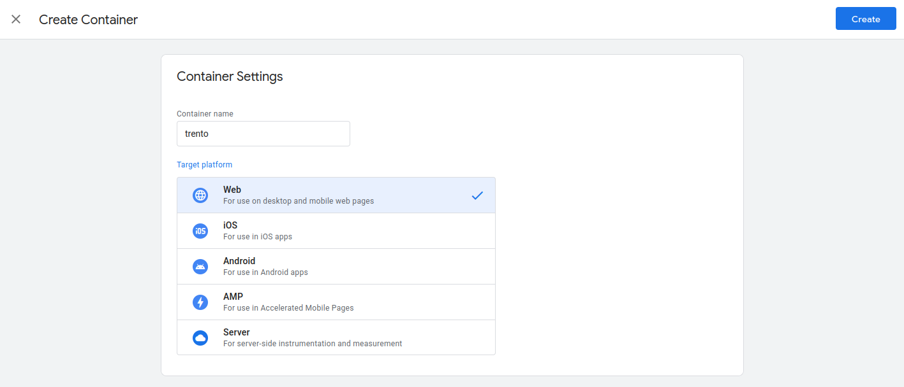
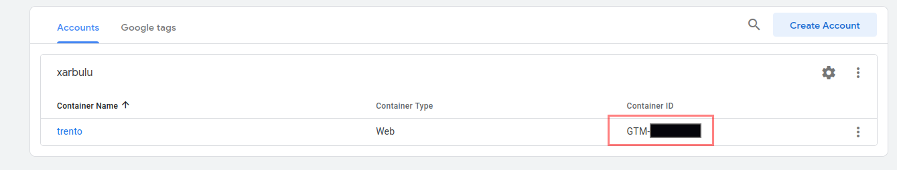
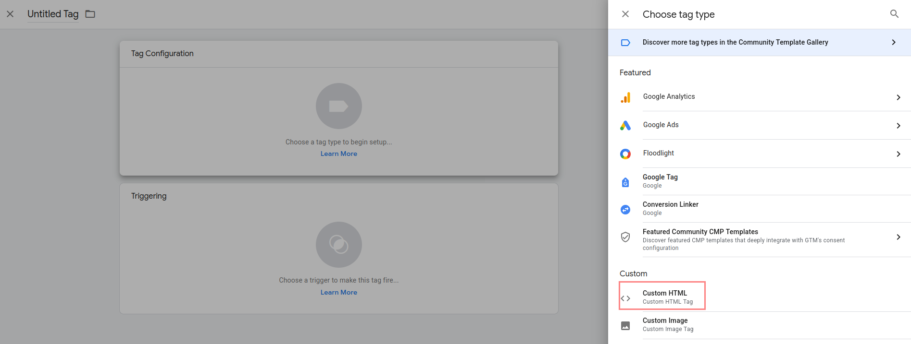
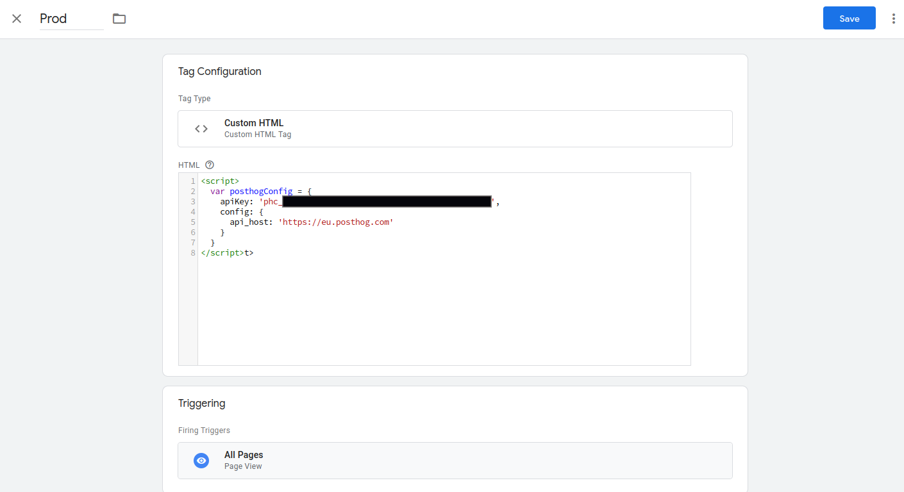
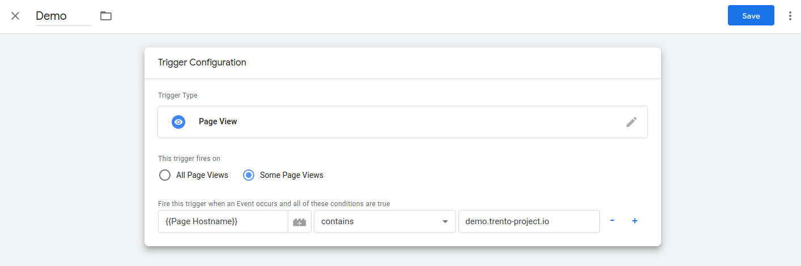
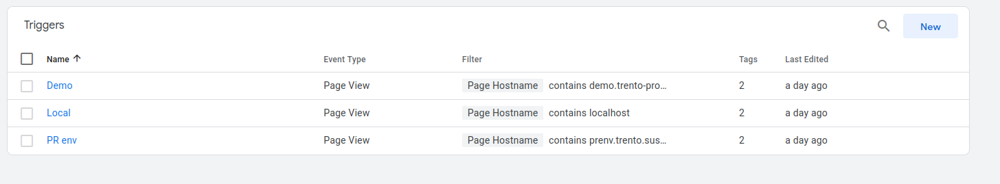
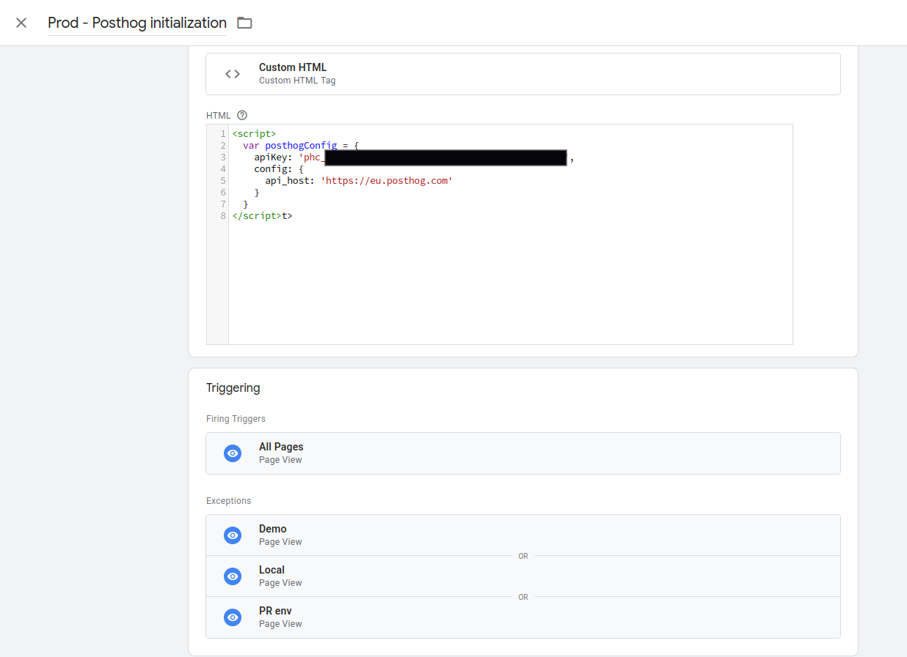
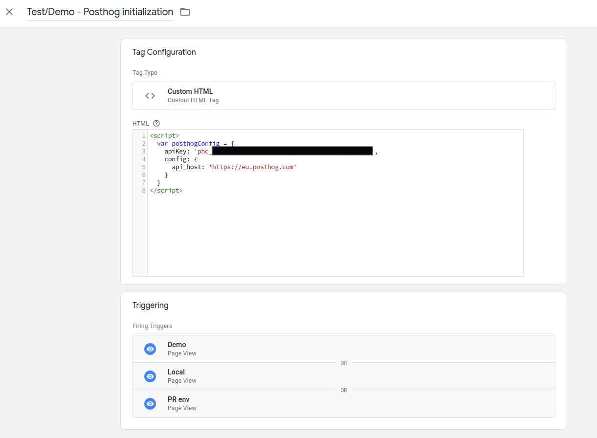
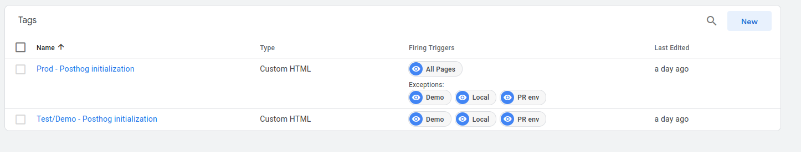
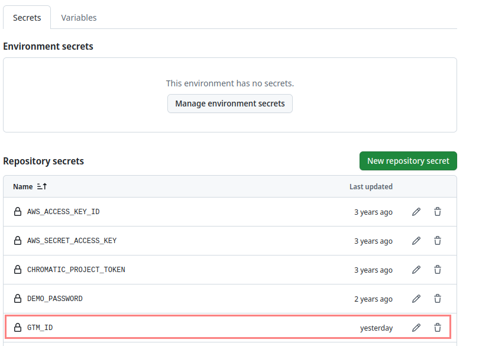

== Analytics setup with Google Tag Manager and PostHog

This guide explains how to set up the analytics environment with
Google Tag Manager (GTM from now on). It assumes that a PostHog account is ready
and a `phc_xxx` API key is available.

=== GTM setup

Follow these steps to set up GTM:

. Create a new container of type `Web` in the GTM account.
+

+

. Get the `Container ID`. This value is used during the `trento-web` artifacts generation.
+

+

. Go to the container.
+
Now, there are two options: a simpler approach and a more "production-ready" approach.
The second includes a "Prod/Test" setup, which comes in handy for having a development/test playground.
The simpler approach is just a subset of the other, so let's start with that one.
+

. Create a new tag of type `Custom HTML`. Put the following content in the HTML tag.
+
The content includes the PostHog configuration, which is sent to the `trento-web` frontend once GTM is loaded.
+
```
<script>
   var posthogConfig = {
      apiKey: 'phc_your_id',
      config: {
         api_host: 'https://eu.posthog.com'
      }
   }
</script>

```
+
*Disclaimer: This piece of script might change over time.*
+
Finally, use the `All Pages` trigger as `Firing Triggers`.
+
 
 
+
With this, the simple approach is done, and GTM is ready to be used.
Let's explain now how to enhance this to have a more production-ready setup.
+

. Create another new tag with the same type and content as the previous one. This one is used for development, so changes don't affect the production environment during tests. Simply use a different name.

. Create Triggers to filter incoming requests by "Page Hostname".
  This enables redirection to different tags. For example, create 3 triggers to filter requests coming from
  the Trento demo page, PR environment pages, and localhost setups.
  Use `PageView` as the type and configure the correct domains to be redirected to the Test/Devel tag.
+

 
+

. Now that the Triggers are created, use them in the Prod and Test tags.
   Add them as exceptions in the Prod tag and as firing triggers in the Test tag.
+
 
  
+

The end result should look like this:
+

+


=== Generate trento-web using the GTM container ID

Once the GTM setup is done and the container ID is available, the `trento-web` artifact can be generated to use it.
Configuring GTM is a compile-time process, so the ID must be provided at this stage.
Use the `GTM_ID` value for that.
```
export GTM_ID=your-id
mix release
```
This is already done in `trent-web` Github Action CI, so it is already automatized.
To set a new `GTM_ID`, change the value from the repository settings secrets.


