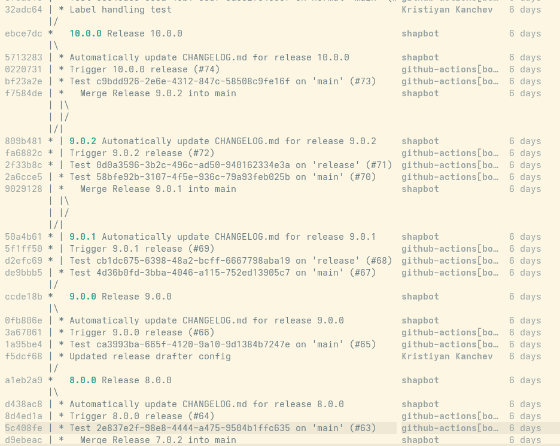

== Release Process

To issue a new version of any Trento component (e.g. Web, Agent,
Wanda, etc.), a simple process must be followed in the context of
the respective repository. +
Most of this process is automated via GitHub Actions.

=== Branching strategy

Trento's branching strategy is chosen so that it fulfills these few
objectives:

1. be simple and straightforward
2. allow for quick releases when the need arises
3. allow for simple versioning for nightly builds

The last point means that there is a need for the latest nightly
builds to be versioned in a way that always sorts greater than the
official release with the biggest versioning number. This is trivial
if the versioning is linear and work is done in a single
branch. However, to be able to release small fixes before work is
feature-complete (point 2.), a need for more branches arises.

Thus, Trento settle for semi-linear approach to branching and
release. This means a Trento repository has two long-running branchesw
-- `main` and `release`. `main` contains the newly developed features
and is kept stable at all times by using Pull Requests, Peer Reviews
and automated CI checks before any new code integration. `release`
branch contains the code from `main` that is ready for release plus
potentially small custom fixes.

We support two types of releases -- *full* and *hotfix*:

Full releases are made by cross-merging `main` and `release` branches
and tagging the resulting merge commit. This merge commit is actually
shared by both branches because when one of the branches is merged
into the other, the reverse operation is a fast-forward merge. Full
releases contain all the new features developed on `main` since the
last full release.

Hotfix releases allow for quick reaction on unforeseen problems with
the released code such as critical bugs found or new security CVE
discovered. Hotfix releases are made directly on `release` branch and
tagged there.

To achieve linear versioning (point 3.) in a simple manner (point 1.)
all release tags should be reachable from `main`. For instance,
built-in tools like `git describe` should correctly identify how many
commits are there since the last release. This is achieved by merging
`release` branch back into `main` when doing hotfix releases.

NOTE: All of this implies that we don't support releasing version
2.0.1, for example, given release 3.0.0 already exits. The next
possible release could only be 3.0.1, 3.1.0 or 4.0.0, e.g. they need
to be monotonically increasing.

In all merges happening between the long-running branches, `main` is
taken as a source of truth and all merge conflicts are auto-resolved
in its favor.

WARNING: Not all Trento repositories are using this branching
strategy. We're still in a process of migrating to this new way of
operation.

Example of test repository using this branching strategy:

=== How to trigger a release

The steps to initiate the process are the same for both types of
releases. They include bumping the version by changing the file
holding the most recent version number, named `VERSION`, located at
the root of the repository and integrate this change as a commit on
the respective branch for the type of release. Both long-running
branches are protected, so only admins can push directly to them. All
the rest of the team members can open a pull-request as usual.

Successfully merging the VERSION file change on the respective branch
triggers the following automated steps:

- automatically generate CHANGELOG entries from the names of the PRs
  merged into the respective branch, new commit is made on the same
  branch for this by the CI bot;
- create necessary version tags on the correct branch;
- publish a GitHub release;
- build container images hosted on ghcr.io;
- update SUSE distribution packages in OBS;

____
⚠️ *Note* +
The Continuous Integration test phase is not executed during this
release process (i.e. changing just the `VERSION` file won’t trigger
any test job), so developers should rely on the fact that the `main`
branch is expected to always be in a green build status. +
If it’s not, one should work to achieve a green build on `main`
_before_ bumping the version.
____

=== Preparation for full releases

There is no special requirements when doing full releases. When the
repository is ready to be released:

- open a PR with the sole change of setting the new version into
  `VERSION` file;
- target the PR towards `main` branch;
- name the PR `Trigger release <version>`
- add label `skip-release-notes` to not include this PR in the changelog;
- notify your team mates
- merge

From then on, the CI finishes the process for you.

=== Preparation for hotfix releases

Hotfix releases warrant more preparation work from the person
doing the release.

There are two paths you can take when doing changes for a
hotfix. However, irrespective of which way you go, the changes
introduced on `release` branch should be made with a PR.

==== Back-porting

In the general case, if a problem is discovered in the release code it
exists on both `main` and `release` branches. So, a fix should be made
on both places. We recommend to first make the fix on `main` and then
"back-port" it to `release`. This would lower the possibility of
anomalies when auto-resolving merges in the CI.

When back-porting you must:

- find the PR that introduced the change on `main` that you want to
  back-port;
- add `released-as-hotfix` label on the already closed/merged PR;
- create a new branch `<some-hotfix-name>` for your backport fix
  starting off from current `release`;
- cherry-pick the changes associated to the origin PR (usually a
  single squashed commit) from `main` into your `<some-hoffix-name>`
  branch;
- open a new PR towards `release` branch for your `<some-hotfix-name>` branch;
- add `released-as-hotfix` label to the newly created PR as well

NOTE: Ideally, the last step (adding the label) should not be
needed. However, it's caused by a limitation in the changelog
generator we currently use.

==== Custom fix directly on `release`

If it's not possible to cherry-pick the change from `main` directly
because it is intertwined with a feature not ready to be released,
then you have to make the fix directly on `release` branch. Later,
when the CI merged `release` back to `main`, you have to double check
if everything was resolved correctly, especially if the fix involves
adding or removing files.

Other than that, the only needed additional step is to mark the PRs
you make towards `release` branch with the label `released-as-hotfix`.

So, when making custom fix you must:
- create a new branch `<some-hotfix-name>` starting off from `release`;
- add you changes;
- open a PR for `<some-hotfix-name>` targeting `release`;
- add label `released-as-hotfix` on that PR;

NOTE: Ideally, adding `released-as-hotfix` label should not be
needed. However, it's caused by a limitation in the changelog
generator we currently use.

==== Trigger the hotfix release

The rest of the steps are the same as for full release, just the
target branch for the PR is different:

- open a PR with the sole change of setting the new version into
  `VERSION` file;
- target the PR towards `release` branch;
- name the PR `Trigger release <version>`
- add label `skip-release-notes` to not include this PR in the changelog;
- notify your team mates;
- merge.

Again, the CI takes it from here.
