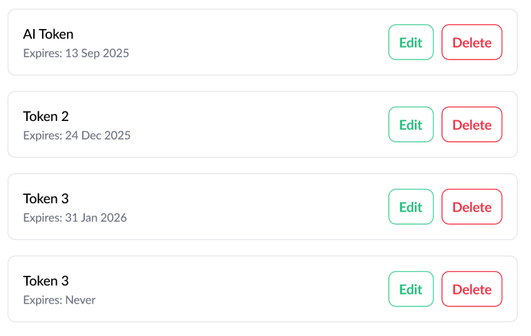

== 2. API Key Management and Authentication

[width="100%",cols="<18%,<82%",]
|===
|Feature Name | API Keys Management and Authentication
|Start Date | Aug26th, 2025
|Category | Architecture, Authnz
|PR | https://github.com/trento-project/docs/pull/92[#92]
|===

:toc:

== Summary

Add api key management and authentication.

== Motivation

We want to simplify third-party clients integrations with Trento's APIs.

Currently such clients would have to:

 * perform a login API request with username/password
 * use the provided `access_token` to make subsequent API calls
 * refresh the token by using the `refresh_token` provided at login
 * use the *new* `access_token` for subsequent API calls

While this approach works well for user-interactive scenarios as the web UI, it may not be ideal for programmatic access or third-party integrations because:

 * to perform initial login, a username/password pair needs to be known/stored by the client application, which may not be feasible or secure in all cases
 * the `access_token` issued at login is short-lived, with a default lifetime of 3 minutes, unless a global configuration is set to extend it
 * the refresh token flow adds complexity to the client requiring it to track current access token expiration or react to unauthorized requests to trigger refresh

This RFC proposes the introduction of API Keys management and the enhancement of the current authentication for an improved support of different kind of clients (agent/UI/third party software)

=== Use Cases outline

 * As a user, I want to generate an API Key with a custom expiration date, so that I can use it for third-party integrations
 * As a user, I want to revoke an API Key, so that I can ensure it is no longer valid and cannot be used
 * As a trento administrator, I want all API Keys of a deleted user to be not usable anymore, to prevent unauthorized access

Edit related use cases are not part of the initial implementation, ie:

 * As a user, I want to change the expiration date of an API Key
 * As a user, I want to regenerate an API Key

== Detailed design

Considering the outlined link:#_use_cases_outline[use cases] we need to:

 * expose CRUD-ish link:#_api_key_operations[operations] to generate/revoke API Keys references
 * link:#_authenticating_api_keys[authenticate API Keys] when used in API calls
 * ensure that all link:#_api_keys_on_service_providers[service components] properly handle API Keys (ie an API Key can also be used to access Wanda's APIs)

NOTE: At the time of writing we are considering the generated API Keys to _carry_ the same permissions as the user who created them.

=== API Key Operations

In order to support standard API Key Management features, the following new operations would be introduced:

* link:#_generate_a_new_api_key[Generate a new API Key] 
* link:#_revoke_an_api_key[Revoke an API Key]
* link:#_retrieve_api_keys[Retrieve API Keys]

*Disclaimer:* endpoints, methods, paths, query strings, parameters are indicative at this point and subject to change.

==== Generate a new API Key

This operation allows to generate a new API Key for the currently logged user.

The user must provide a name and an expiration date:

 * name is mandatory and should be unique within the user's scope
 * expiration date should be in ISO 8601 format
 * expiration date can be omitted or provided as `null` to indicate no expiration (non-expiring keys are still under evaluation)

*Endpoint*

`+POST /profile/api_keys+`

*Request*
[source,json]
----
{
    "name": "an-api-key-name",
    "expire_at": "2025-12-31T23:59:59Z"
}
----

*Response*
[source,json]
----
{
    "name": "foo",
    "expire_at": "2025-12-31T23:59:59.000000Z",
    "created_at": "2025-08-28T15:17:25.065254Z",
    "access_token": "<THE-GENERATED-TOKEN>"
}
----

The generated `access_token` must be included in the Authorization header when making API calls.

[source,console]
----
$ curl -X GET "..." -H "Authorization: Bearer <THE-GENERATED-TOKEN>"
----

Note that:

 * this is the only place where the `access_token` would be exposed.
 * the token is not stored in trento

==== Revoke an API Key

This operation deletes the reference to an API Key and as a result, the API Key will no longer be valid and cannot be used, regardless of its expiration date. See link:#_guarding_against_revoked_tokens[Guarding against revoked tokens].

*Endpoint*

`+DELETE /profile/api_keys/:name+`

Note that using `name` is safe because in combination with the currently logged user identifier, it uniquely identifies the API Key.

==== Retrieve API Keys

This operation exposes the list of API Keys metadata for the currently logged user. +
The actual token is exposed only once at generation time.

*Endpoint*

`+GET /profile/api_keys+`

*Response*
[source,json]
----
[
    {
        "name": "foo",
        "expire_at": "2025-12-31T23:59:59.000000Z",
        "created_at": "2025-08-29T08:06:05.931995Z"
    },
    {
        "name": "bar",
        "expire_at": "2025-09-19T22:00:00.078446Z",
        "created_at": "2025-08-29T08:05:22.051956Z"
    },
    {
        "name": "baz",
        "expire_at": null,
        "created_at": "2025-08-29T07:49:20.078446Z"
    }
]
----

Its response will be used to build the API Keys list UI

=== Authenticating API Keys

Since an API Key is effectively a JWT that will then be used to authenticate requests, the idea is to levarage https://datatracker.ietf.org/doc/html/rfc7519#section-4[JWT Claims] to attach relevant information for authentication flow.

==== Determining authentication rule

Currently Trento supports two different authentication flows:

 * agents: they send an agent specific token via a `X-Trento-apiKey: <token>` header
 * user based authorization (ie UI): token is sent via a `Authorization: Bearer <token>` header

By introducing api keys we need a way to distinguish whether we are user based requests or api keys requests.

===== *Option 1: use a different header*

1a: use `X-Trento-ApiKey: <token>` header for API Key requests. +
This would mean changing the way we process requests for agents and make sure they use a different header like `X-Trento-Agent-ApiKey: <token>`.

1b: use a complete different naming for api keys like `X-Trento-User-ApiKey: <token>` or the like

===== *Option 2: rely on the claims shape*

We could use the same `Authorization: Bearer <token>` header for API Key requests, and rely on the claims shape of a presented token (e.g. check for the presence of a specific claim).

This would allow us to keep headers combinations slim and simple.

'''

Both options 1b and 2 are equally valid. +
Option 2, though, has the advantage of not requiring changes to the way we process requests for agents, besides keeping headers combinations simple.

==== Guarding against revoked tokens

We want to make sure that a revoked (aka deleted/not existent) token - even though not expired yet - cannot be used, and to do so we need a bit of information within the token's claims so that we can query for its existence.

===== *Option 1: rely on `jti` claim*

We can rely on the https://datatracker.ietf.org/doc/html/rfc7519#section-4.1.7[`jti`] claim and have it stored alongside with token's metadata for checking existence at authentication time.

By using a UUID as `jti` claim we are pretty confident about its uniqueness, making it safe to query against for existence.

===== *Option 2: attach the token identifier to the JWT*

If we don't use jti we'd need to rely on a private claim name to include the token identifier - for instance the row id in the database - in the JWT.

In order to reduce claim name collision chances, we can namespace trento related claims. 

For example:
[source,json]
----
{
  "sub": "<user_id>",
  "exp": "<expiration_date>",
  "trnttknid": "<api_key_id>"
}
----
or via an object that allows for reduced repetition of `trnt` in case of extra claims needed
[source,json]
----
{
  "sub": "<user_id>",
  "exp": "<expiration_date>",
  "trnt": {
    "tknid": "<api_key_id>"
  }
}
----

NOTE: https://datatracker.ietf.org/doc/html/rfc7519#section-4.1[All the names are short because a core goal of JWTs is for the representation to be compact]

'''

Option 1 fits well as it relies on the standard JWT identification.

=== API Keys on service providers

Trento is composed of multiple services, each potentially requiring to authenticate and authorize a presented token.

Currently https://github.com/trento-project/wanda[Wanda] is the only service that exposes authenticated resources, besides web.

However, unlike web, Wanda does not have knowledge about the API keys (to determine whether one has been revoked/invalidated) nor users (to make sure abilities attached to a token are still valid for the given user).

This is a concern because unauthorized access could be granted to Wanda's resources even if the token has been revoked/invalidated and additionally to that, the user's abilities may have changed since the token was first issued.

Options are:

 . make sure Wanda does not accept any requests made with an API key
 . introduce a mechanism for Wanda to validate API keys and user permissions (ie communicate with web's relevant APIs)
 . consider the introduction of a proxy/API gateway that does validate tokens before hitting a resource provider

This section might require an RFC on its own.

== Drawbacks

The main identified drawback revolves around the API key consistency across services.

== Alternatives

== Unresolved questions

The main unresolved question is about link:_api_keys_on_service_providers[API keys on service providers]:

 . How can we ensure that API keys are properly revoked/invalidated across all services?
 . How to make sure that user permissions are consistent across all services?

