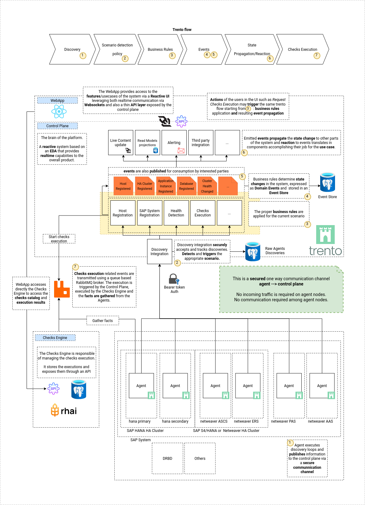
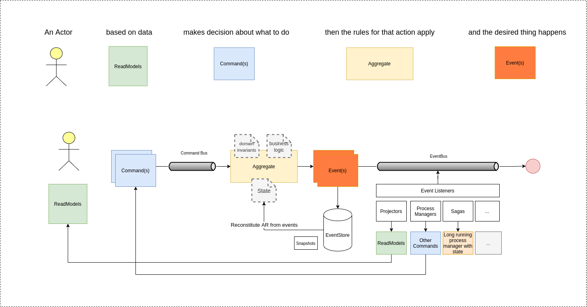

== Trento Architecture

Here’s a high level view of what we do to achieve the result of
providing a reactive event driven system.

.Trento Architecture

=== Discovery

https://github.com/trento-project/agent[Trento Agent] extracts relevant
information on the target infrastructure and publishes those to the
control plane. +
_(cluster discoveries, host discoveries, cloud discoveries…)_

The control plane Discovery integration securely accepts published
discoveries, stores them and triggers Scenario Detection.

'''''

=== Scenario Detection

The https://github.com/trento-project/web[control plane] discovery
integration leverages specific policies to determine the scenario to be
triggered based on the discovered information.

That means we need to be able to determine which command to dispatch in
the application. _(RegisterHost, RegisterDatabaseInstance and so
forth…)_

'''''

=== Business rule validation

The detected scenario dispatches the needed command(s) which trigger
validation of the requested action(s) against the current state and the
proper business rules for the usecase.

'''''

=== Events & State change

Going through the previous steps of dispatching and action in the system
and applying business rules to the process, translates in things
actually happening (or not) and changing some state (or not).

When things happen we represent them as *events*
(_SAPSystemHealthChanged, ChecksExecutioncompleted_), we store them in
an append only *Event Store* and use them as the source of truth of the
system (or part of it).

See Event Sourcing
https://martinfowler.com/eaaDev/EventSourcing.html[here]

'''''

=== State Propagation & Reaction

Once things happen the system notifies the world about it by emitting
the recorded events so that interested components can listen for those
and react accordingly.

Reaction may be any orthogonal listener responsible to deliver part of
the feature being served.

Some of possible _reactions_ - projecting read optimized models for
specific usecases (_Clusters, Hosts, Heartbeats_) maybe later served via
APIs - Sending and email _whenever a SAP System’s health goes critical_
- Broadcasting changes to the Reactive UI via websockets - Third party
software integration - … —

=== Checks Execution

The Checks Execution is managed by the
https://github.com/trento-project/wanda[Checks Engine]. It uses the
https://github.com/trento-project/checks[Trento configuration checks
catalog], which consists of `+yaml+` files. Each check includes a script
written in https://rhai.rs/[Rhai] which is what the check tries to
evaluate with some facts coming from the targets.

This component is responsible of: - Listening for checks execution
requests coming from the control plane (or any other external user) -
Sending the fact gathering requests to the appropriate targets -
Evaluating check results using the gathered facts - Publishing the
evaluated results - Storing and exposing the executed executions

=== General Considerations

https://github.com/commanded/commanded[CQRS with Commanded] supports
complex domain modeling, however, whenever possible we use simpler
implementations for non-critical aspects (_Tagging_ for instance, is a
basic CRUD operation).

Find here a simple diagram to understand how CQRS works:

