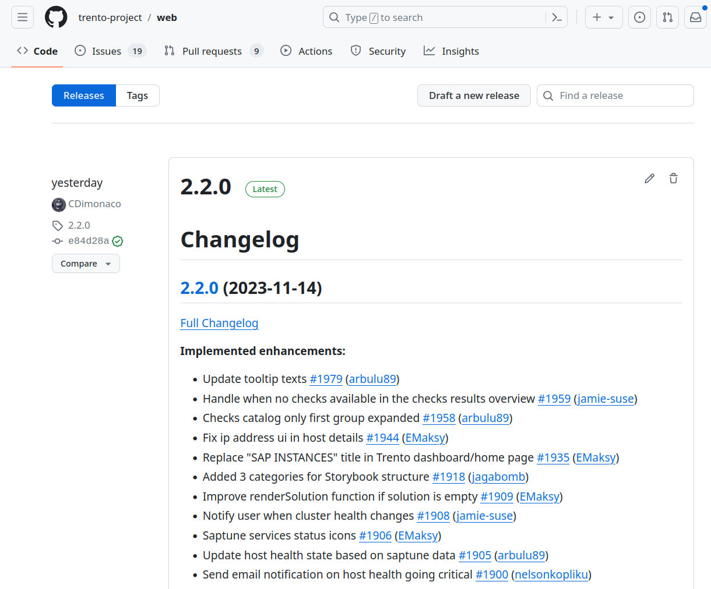

# GitHub Release Process

## Step Zero: Requirements:

1. **GitHub Token:**
   - [Setup a GitHub token by going to your GitHub account](https://docs.github.com/en/enterprise-server@3.6/authentication/keeping-your-account-and-data-secure/managing-your-personal-access-tokens) (`Settings` -> `Developer Settings` -> `Personal access tokens` -> `Generate a new token`).
2. **Install GitHub Changelog Generator:**
   - Install the [GitHub Changelog Generator](https://github.com/github-changelog-generator/github-changelog-generator) by following the instructions.

### Step One: Prepare for Release

1. **Merge Changes:**
   - Ensure all relevant changes, fixes, and features are merged into the main branch.
2. **Tagging Pull Requests:**
   - Add appropriate tags to all pull requests (PR) intended for the release. This ensures a cleaner and organized changelog.

### Step Two: Update Changelog

1. **Pull Latest Changes:**
   - Navigate to the project directory and pull the latest changes.
2. **Change Log Branch:**
   - Create a new branch for the changelog.
3. **Generate Changelog:**
   - Utilize the GitHub Changelog Generator Docker image or CLI to generate the changelog.

CLI:

```bash
github_changelog_generator --since-tag= <<CURRENT_TAG>> --future-release= <<RELEASE_VERSION_TAG>> -t <<GITHUB_TOKEN>> -p <<PROJECT_NAME>> -u <<PROJECT_GROUP>> --base CHANGELOG.md
```

| Variables:          | Explanation:                                                                                                       | Examples:                                                                                                                                 |
| ------------------- | ------------------------------------------------------------------------------------------------------------------ | ----------------------------------------------------------------------------------------------------------------------------------------- |
| CURRENT_TAG         | Changelog will start after specified tag.                                                                          | 2.1.0                                                                                                                                     |
| RELEASE_VERSION_TAG | Future Project Version                                                                                             | 2.2.0                                                                                                                                     |
| PROJECT_NAME        | Name of project on GitHub                                                                                          | agent,web,wanda                                                                                                                           |
| GITHUB_TOKEN        | Your personal Github Token                                                                                         | https://docs.github.com/en/enterprise-server@3.6/authentication/keeping-your-account-and-data-secure/managing-your-personal-access-tokens |
| PROJECT_GROUP       | Username of the owner of the target GitHub repo OR the namespace of target Github repo if owned by an organization | trento-project                                                                                                                            |

CLI Example:

```bash
github_changelog_generator --since-tag=2.1.0 --future-release=2.2.0 -p agent -t <<GITHUB_TOKEN>> -u trento-project --base CHANGELOG.md
```

### Step Three: Version Bump

1. **Version Upgrade:**

   - Search for the current version in the project and perform a version bump.

   Examples:

   - [Agent](https://github.com/EMaksy/agent/commit/df9bce2692ee46d3faa548494ec7ba40a22d1873)
   - [Web](https://github.com/trento-project/web/commit/05dca928b43c203a43839c40df9de419f4d9e1b4)
   - [Wanda](https://github.com/trento-project/wanda/commit/57d4a64980f75c0e687d424fe5554feb9c0545d5)
   - [Helm-Chart](https://github.com/trento-project/helm-charts/commit/1a1d638ee8409a3c5b91609b18ac901c7b7a9fe7)

2. **Create Pull Request:**

   - Create a pull request that includes the changelog and version upgrade.

### Step Four: Merge branch with main

### Step Five: Release on GitHub

1. **Draft New Release:**
   - [Go to the repository's releases section and draft a new release](https://docs.github.com/en/repositories/releasing-projects-on-github/managing-releases-in-a-repository).
2. **Release Details:**

- Use the generated changelog as the release description.

1. **GitHub Actions Check:**

- Check the preview and ensure that GitHub Actions have passed.

1. **Final Approval:**

- If everything is fine, finalize and publish the release.



This concludes the GitHub release process. The CI system will automatically submit the changes to our internal build service. For the next steps, proceed with our internal release process
